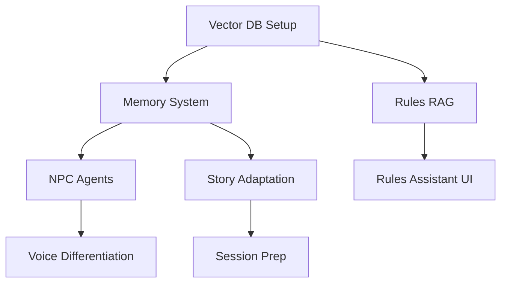

# AI Feature Roadmap

## Priority Matrix

```
                    High Impact
                        │
    ┌───────────────────┼───────────────────┐
    │                   │                   │
    │  P1: DO FIRST     │  P2: SCHEDULE     │
    │  ─────────────    │  ──────────────   │
    │  • Memory System  │  • NPC Agents     │
    │  • Context Mgr    │  • Story Adapt    │
    │  • Rules RAG      │  • Portraits      │
    │                   │                   │
Low ├───────────────────┼───────────────────┤ High
Effort                  │                    Effort
    │                   │                   │
    │  P3: FILL-INS     │  P4: CONSIDER     │
    │  ─────────────    │  ──────────────   │
    │  • Session Recap  │  • Map Gen        │
    │  • Char Assistant │  • Voice Variety  │
    │  • Encounter Gen  │  • Analytics      │
    │                   │                   │
    └───────────────────┼───────────────────┘
                        │
                   Low Impact
```

---

## Phase 1: Foundation (Weeks 1-8)

### 1.1 Enhanced Memory System
**Priority**: P1 | **Effort**: 3 weeks

- [ ] Set up ChromaDB/Pinecone for vector storage
- [ ] Implement memory schema (Event, Dialogue, Decision types)
- [ ] Create embedding pipeline for session logs
- [ ] Build semantic search API
- [ ] Implement relevance scoring algorithm
- [ ] Add token budget management

**Success Criteria**:
- Memory retrieval latency < 200ms
- Relevance accuracy > 90%

### 1.2 Context Manager Upgrade
**Priority**: P1 | **Effort**: 2 weeks

- [ ] Abstract context assembly logic
- [ ] Implement priority-based context injection
- [ ] Add dynamic token budgeting
- [ ] Create context caching layer
- [ ] Build context debugging tools

**Success Criteria**:
- Context assembly < 100ms
- Zero context overflow errors

### 1.3 Rules Assistant (RAG)
**Priority**: P1 | **Effort**: 2 weeks

- [ ] Index D&D 5e SRD into vector store
- [ ] Create rules query endpoint
- [ ] Implement citation tracking
- [ ] Add confidence scoring
- [ ] Build rules validation helper

**Success Criteria**:
- Rules accuracy > 98%
- Response time < 2s

### 1.4 Character Creation Assistant
**Priority**: P3 | **Effort**: 1 week

- [ ] Design conversation flow
- [ ] Create backstory generation prompts
- [ ] Implement build suggestions
- [ ] Add multiclass recommendations
- [ ] Integrate with character creation UI

---

## Phase 2: Intelligence (Weeks 9-16)

### 2.1 Intelligent NPC System
**Priority**: P2 | **Effort**: 3 weeks

- [ ] Design NPC agent architecture
- [ ] Implement personality persistence
- [ ] Create relationship tracking system
- [ ] Build goal-driven behavior engine
- [ ] Add emotional state modeling
- [ ] Implement NPC memory isolation

**Success Criteria**:
- NPCs maintain consistent personality
- Relationship changes reflected in dialogue

### 2.2 Dynamic Story Adaptation
**Priority**: P2 | **Effort**: 3 weeks

- [ ] Build player preference tracker
- [ ] Implement difficulty adjustment engine
- [ ] Create plot hook generator
- [ ] Add pacing analysis
- [ ] Build backstory integration system

**Success Criteria**:
- Player engagement +20%
- Story coherence maintained

### 2.3 Session Preparation Assistant
**Priority**: P3 | **Effort**: 2 weeks

- [ ] Create "Previously on..." summarizer
- [ ] Build plot reminder system
- [ ] Implement NPC prep notes generator
- [ ] Add encounter suggestions
- [ ] Create session planning checklist

---

## Phase 3: Content Generation (Weeks 17-24)

### 3.1 Character Portraits
**Priority**: P2 | **Effort**: 2 weeks

- [ ] Integrate DALL-E 3 / Stable Diffusion
- [ ] Create portrait prompt templates
- [ ] Implement style consistency
- [ ] Add portrait variation generation
- [ ] Build gallery management

### 3.2 Encounter Generator
**Priority**: P3 | **Effort**: 2 weeks

- [ ] Implement CR-based balancing
- [ ] Create thematic encounter templates
- [ ] Add terrain/environment generation
- [ ] Build loot table integration
- [ ] Implement difficulty scaling

### 3.3 Map Generation (Basic)
**Priority**: P4 | **Effort**: 3 weeks

- [ ] Evaluate map generation options
- [ ] Implement procedural dungeon layouts
- [ ] Create battle map generator
- [ ] Add location templates
- [ ] Build map export functionality

---

## Phase 4: Polish (Weeks 25-32)

### 4.1 Voice Differentiation
**Priority**: P4 | **Effort**: 2 weeks

- [ ] Expand ElevenLabs voice profiles
- [ ] Implement per-NPC voice mapping
- [ ] Add emotional tone adaptation
- [ ] Create accent/dialect options

### 4.2 Campaign Analytics
**Priority**: P4 | **Effort**: 2 weeks

- [ ] Build engagement tracking
- [ ] Implement combat balance analysis
- [ ] Create story pacing insights
- [ ] Add session quality metrics

### 4.3 Performance Optimization
**Priority**: P1 | **Effort**: 2 weeks

- [ ] Implement response streaming
- [ ] Add aggressive caching
- [ ] Optimize model routing
- [ ] Reduce cold start times

---

## Quick Wins (Can Start Anytime)

These features can be implemented independently:

| Feature | Effort | Impact |
|---------|--------|--------|
| Session recap emails | 2 days | Medium |
| Dice roll explanations | 1 day | Low |
| Combat initiative suggestions | 2 days | Medium |
| Spell lookup assistant | 3 days | Medium |
| Random NPC generator | 2 days | Medium |

---

## Dependencies



---

## Resource Requirements

### Infrastructure
- Vector database (ChromaDB self-hosted or Pinecone)
- Redis for caching
- Image storage (S3/CloudFlare R2)
- GPU access for local models (optional)

### API Services
- Anthropic API (Claude)
- OpenAI API (DALL-E, optional)
- ElevenLabs API
- Whisper API (or self-hosted)

### Team
- Backend: Memory system, AI services
- Frontend: UI integration, real-time updates
- ML/AI: Prompt engineering, fine-tuning

---

## Success Metrics by Phase

| Phase | Key Metric | Target |
|-------|------------|--------|
| 1 | Context relevance | > 90% |
| 2 | Player engagement | +20% |
| 3 | Content usage rate | > 50% |
| 4 | Response latency | < 2s |

---

*Last Updated: 2026-01-27*
